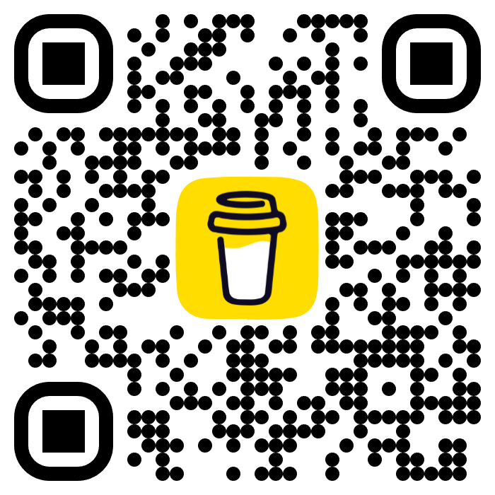

  

  
  

  
  
  

# 👋 Hi, I'm Marcus Burghardt!

I'm passionate about 🔐 Cybersecurity, 🐧 Linux, 🤖 Automation, and the Open-Source ecosystem — fields that thrive on innovation and collaboration.

Open-Source is the backbone of technology, and I strive to contribute by 📢 sharing secure, high-quality solutions.
My projects aim to solve real problems and empower the Community.

If my work has helped you save time, solve a challenge, or inspire new ideas, consider supporting me with a [virtual coffee or beer][bmc_url].

Explore my GitHub repositories, contribute, share feedback, or spark new ideas. Together, we make Open-Source stronger!

Cheers to collaboration and innovation!

## 📊 GitHub Statistics

## 🛠️ Main Languages I Use

## 🚀 Support Me

Your support fuels my commitment to creating impactful, reliable tools for everyone. 💪🙏😊

[bmc_url]: https://www.buymeacoffee.com/marcusburghardt
 

_Last updated on: `2025-01-01`_